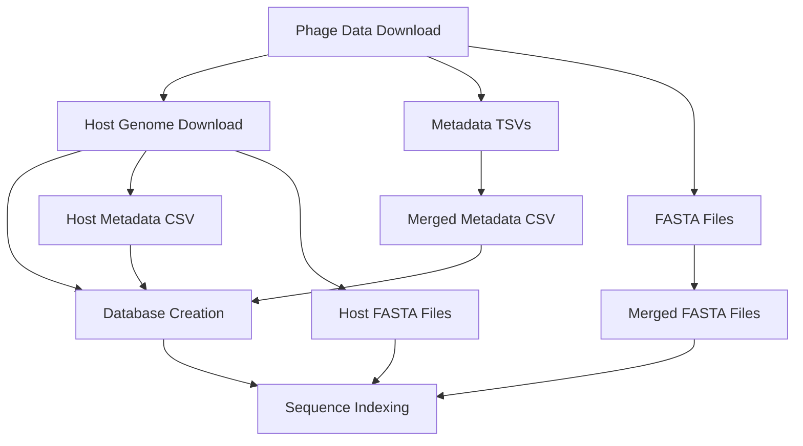

# Pipeline Execution Guide

This guide explains how to execute the PBI data pipeline, particularly focusing on the host genome download step, and how to track and analyze the results.

## Overview

The PBI pipeline consists of several major steps:

1. **Phage Data Collection** - Download phage metadata and sequences from multiple databases
2. **Host Genome Download** - Download bacterial host genomes from NCBI RefSeq
3. **Database Population** - Load all data into DuckDB database
4. **FASTA Index Creation** - Create index files for fast sequence access

This guide focuses on the **Host Genome Download** step, which is where most tracking and logging occurs.

---

## Host Genome Download Pipeline

### Architecture Overview

The host genome download pipeline follows this workflow:

```
Phage Metadata (CSV)
        ↓
Extract Unique Host Species
        ↓
Validate Species Names
        ↓
Search NCBI RefSeq → [Cache Check]
        ↓
Download Genome FASTA
        ↓
Calculate Stats (Length, GC%, Sequence Count)
        ↓
Save to Cache + Metadata CSV
```

**Key Components:**

- **Input**: Phage metadata CSV with host species names
- **Cache**: SQLite database + FASTA files to avoid re-downloading
- **Output**: 
  - Individual genome FASTA files (`{species}_{accession}.fna`)
  - Metadata CSV with download statistics
  - Failure log for troubleshooting

### Re-executing the Pipeline

#### Using Snakemake (Recommended)

The pipeline is orchestrated by Snakemake. To re-run the host genome download step:

```bash
# Full pipeline execution
snakemake --cores 4 --use-conda

# Re-run only host genome download (force re-execution)
snakemake --cores 4 --use-conda --forcerun download_host_genomes

# Re-run with specific number of species (for testing)
snakemake --cores 4 --use-conda --config limit=100
```

**Configuration File**: `workflow/config/genome_download_config.yaml`

```yaml
ncbi:
  email: your.email@example.com  # Required by NCBI
  api_key: ""  # Optional, increases rate limit to 10 req/sec

download:
  max_concurrent: 5
  requests_per_second: 3  # Use 10 with API key
  timeout: 30
  max_retries: 3

cache:
  enabled: true
  directory: "data/cache/genomes"
  metadata_db: "data/cache/metadata.db"
```

#### Manual Execution

For debugging or custom workflows:

```bash
cd workflow/scripts/sequences

python download_host_genomes_optimized.py \
    --input ../../data/intermediate/phage_metadata.csv \
    --output ../../data/processed/genomes \
    --config ../../config/genome_download_config.yaml \
    --metadata ../../data/intermediate/csv/merged/host_metadata.csv \
    --limit 10  # Optional: limit for testing
```

---

## Tracking Download Progress

### Real-time Progress

During execution, you'll see progress updates:

```
🚀 Starting optimized host genome download pipeline
📥 Starting downloads for 9,765 species

Progress: ████████░░░░░░░░░░ 1,234/9,765 (12.6%)
✅ Success: 1,100 | ❌ Failed: 89 | 📦 Cached: 45
ETA: 1.2 hours | Rate: 15.3 genomes/min
```

**Key Metrics:**
- **Success**: Downloaded successfully
- **Failed**: Could not download (see failure log)
- **Cached**: Already in cache (no re-download needed)
- **Rate**: Current download speed

### Output Files and Tracking Information

#### 1. Metadata CSV (`host_metadata.csv`)

**Location**: `data/intermediate/csv/merged/host_metadata.csv`

This CSV contains **successful** downloads with full tracking information:

```csv
Host_ID,Species_Name,Strain_Name,Assembly_Accession,Assembly_Name,Assembly_Level,Genome_Length,GC_Content,Sequence_Count,RefSeq_Category,Download_Date,Source
Escherichia_coli_GCF_000005845.2,Escherichia coli,K-12,GCF_000005845.2,ASM584v2,Complete Genome,4641652,50.79,1,reference genome,2024-01-15,RefSeq
```

**Key Columns:**
- `Host_ID`: Unique identifier used in database and FASTA filename
- `Species_Name`: Original species name from phage metadata
- `Assembly_Level`: Quality indicator (Complete Genome > Chromosome > Scaffold > Contig)
- `Genome_Length`: Total genome size in base pairs
- `GC_Content`: GC percentage (useful for quality checks)
- `Sequence_Count`: **NEW** - Number of sequences in assembly (1 for complete genomes, higher for draft assemblies)
- `Download_Date`: When genome was downloaded

**How to Read This CSV:**

```python
import pandas as pd

# Load metadata
metadata = pd.read_csv('data/intermediate/csv/merged/host_metadata.csv')

# Summary statistics
print(f"Total genomes: {len(metadata)}")
print(f"Complete genomes: {(metadata['Assembly_Level'] == 'Complete Genome').sum()}")
print(f"Average GC content: {metadata['GC_Content'].mean():.2f}%")

# Check for highly fragmented assemblies
fragmented = metadata[metadata['Sequence_Count'] > 100]
print(f"Highly fragmented (>100 sequences): {len(fragmented)}")
print(fragmented[['Species_Name', 'Assembly_Level', 'Sequence_Count']])
```

#### 2. Failure Log (`failed_downloads.txt`)

**Location**: `data/logs/failed_downloads.txt` (or as configured)

This file contains **failed** downloads categorized by reason:

```
=== Download Failures Report ===
Generated: 2024-01-15 14:30:45
Total failures: 89

Category: No assembly found (45 species)
  - GTDB placeholder sp001234567
  - Unknown species
  - Acidovorax sp. (too generic, multiple matches)

Category: Download failed (15 species)
  - Bacillus cereus (timeout after 3 retries)
  - Pseudomonas aeruginosa (connection error)

Category: Pre-validation failed (29 species)
  - sp002345678 (GTDB identifier - skipped)
  - - (empty/missing host name)
  - unknown host (placeholder)
```

**Common Failure Reasons:**
- **No assembly found**: Species not in NCBI RefSeq
- **GTDB identifiers**: Placeholder IDs (sp000123456) from GTDB taxonomy
- **Generic names**: "Acidovorax sp." without strain info
- **Network errors**: Temporary NCBI connection issues
- **Empty/placeholder names**: "-", "unknown host"

**How to Investigate Failures:**

```python
# Read failure log
with open('data/logs/failed_downloads.txt') as f:
    failures = f.read()

# Count by category
import re
categories = re.findall(r'Category: (.*?) \((\d+)', failures)
for category, count in categories:
    print(f"{category}: {count} failures")
```

#### 3. Missing Hosts CSV (from Notebooks)

**Location**: Specified when creating datasets (e.g., `missing_hosts.csv`)

When using datasets in notebooks, you can track which phage-host pairs are missing host genomes:

```python
from pbi import SequenceRetriever

retriever = SequenceRetriever(
    db_path="database.duckdb",
    phage_fasta_path="all_phages.fasta",
    protein_fasta_path="all_proteins.fasta",
    host_mapping_path="host_mapping.json"
)

# Create dataset with missing hosts tracking
dataset = retriever.create_indexed_dataset(
    where_clause="LIMIT 1000",
    missing_hosts_csv="analysis/missing_hosts.csv"
)

# After iterating through dataset
# missing_hosts.csv will contain:
# Phage_ID,Host_ID,Species_Name,Phage_Source,Phage_Length,Phage_Taxonomy,Host_Assembly_Level,Failure_Reason
```

This CSV helps identify:
- Which phages don't have matching host genomes
- Why the host genome couldn't be retrieved (not downloaded vs. not in database)
- Patterns in missing data (e.g., all from certain database)

---

## Log Analysis

### Log Locations

| Component | Log Location | Contents |
|-----------|--------------|----------|
| Snakemake | `logs/snakemake.log` | Overall pipeline execution |
| Host Download | `logs/host_download.log` | Download progress and errors |
| Database Load | `logs/database.log` | Database population |
| Failures | `data/logs/failed_downloads.txt` | Categorized failures |

### Reading Logs

#### Check Overall Progress

```bash
# View host download log (live tail)
tail -f logs/host_download.log

# Count successes and failures
grep "✅ Downloaded" logs/host_download.log | wc -l
grep "❌ Download failed" logs/host_download.log | wc -l

# Find specific species
grep -i "escherichia coli" logs/host_download.log
```

#### Analyze Error Patterns

```bash
# Most common errors
grep "ERROR" logs/host_download.log | sort | uniq -c | sort -rn | head

# Network timeout issues
grep -i "timeout" logs/host_download.log | wc -l

# NCBI rate limiting (429 errors)
grep "429" logs/host_download.log
```

#### Cache Statistics

```bash
# Check cache hits (avoid re-downloads)
grep "📦 Cache hit" logs/host_download.log | wc -l

# Cache efficiency
python << 'EOF'
import re

with open('logs/host_download.log') as f:
    log = f.read()

cached = len(re.findall(r'📦 Cache hit', log))
downloaded = len(re.findall(r'✅ Downloaded', log))
failed = len(re.findall(r'❌ Download failed', log))

total = cached + downloaded + failed
if total > 0:
    print(f"Cache efficiency: {cached/total*100:.1f}%")
    print(f"Success rate: {(downloaded+cached)/total*100:.1f}%")
EOF
```

---

## Troubleshooting

### Issue: High Failure Rate

**Symptoms**: >20% failures in download

**Diagnosis:**
```bash
# Check failure categories
cat data/logs/failed_downloads.txt | grep "Category:"
```

**Solutions:**
- If "No assembly found": Normal for some species, may need manual curation
- If "Download failed": Check network, increase retries in config
- If "GTDB identifiers": Expected, these are filtered out automatically

### Issue: Slow Download Speed

**Symptoms**: <5 genomes/minute

**Diagnosis:**
```bash
# Check rate limiting
grep "Rate limiter" logs/host_download.log
```

**Solutions:**
1. Add NCBI API key to config (increases from 3 to 10 req/sec)
2. Increase `max_concurrent` in config
3. Check network bandwidth

### Issue: Incomplete Download

**Symptoms**: Pipeline stopped mid-execution

**Recovery:**
```bash
# Resume from checkpoint (cache prevents re-downloads)
snakemake --cores 4 --use-conda --rerun-incomplete
```

The cache system ensures completed downloads aren't repeated.

---

## Best Practices

### For Production Runs

1. **Set NCBI Email**: Required by NCBI Terms of Service
2. **Use API Key**: Significantly faster (3x-10x)
3. **Enable Cache**: Avoid re-downloading on failures
4. **Monitor Progress**: Use `--verbose` flag for detailed logs
5. **Save Logs**: Archive logs with date for reproducibility

```bash
# Production execution with logging
snakemake --cores 8 --use-conda \
    --config ncbi_email=your@email.com ncbi_api_key=YOUR_KEY \
    2>&1 | tee logs/pipeline_$(date +%Y%m%d).log
```

### For Development/Testing

1. **Use Limit**: Test with small subset first
2. **Check Failures**: Review failure log before full run
3. **Validate Config**: Ensure paths and credentials are correct

```bash
# Test run with 100 species
snakemake --cores 4 --use-conda --config limit=100
```

---

## Complete Pipeline Steps Overview

This section provides a detailed breakdown of all pipeline steps, their inputs, outputs, and data flow.

### Pipeline Architecture



### Step-by-Step Pipeline Execution

#### Step 1: Phage Metadata Download

**Purpose**: Download phage metadata from multiple databases (RefSeq, GenBank, PhageScope, etc.)

**Snakemake Rule**: Multiple rules in `workflow/rules/phagescope.smk`

**Inputs**: 
- URL list from `workflow/config/config.yaml`
- Databases: RefSeq, GenBank, EMBL, DDBJ, PhagesDB, GVD, GPD, MGV, etc.

**Outputs**:
- Individual TSV files: `data/intermediate/csv/[feature]/[source].tsv`
- Merged CSV: `data/intermediate/csv/merged/merged_phage_metadata.csv`
- Report: `data/processed/reports/phage_metadata_report.html`

**Key Features Downloaded**:
1. Phage metadata (basic information)
2. Annotated proteins metadata
3. tRNA/tmRNA metadata
4. Anti-CRISPR metadata
5. Virulent factor metadata
6. Transmembrane protein metadata
7. Antimicrobial resistance genes
8. CRISPR arrays

**Execution**:
```bash
snakemake --cores 4 --use-conda phage_metadata_merged_output
```

---

#### Step 2: Phage FASTA Download

**Purpose**: Download phage genome sequences in FASTA format

**Snakemake Rule**: `download_and_extract_phage_fasta` in `workflow/rules/phagescope.smk`

**Inputs**:
- Compressed TAR.GZ files from PhageScope API
- One per database source

**Outputs**:
- Compressed: `data/raw/phage_fasta_compressed/`
- Extracted: `data/raw/phage_fasta_extracted/`
- Merged per source: `data/intermediate/fasta/phages/[source].fasta`
- Final merged: `data/processed/sequences/all_phages.fasta`

**Execution**:
```bash
snakemake --cores 4 --use-conda all_phages_fasta
```

---

#### Step 3: Protein FASTA Download

**Purpose**: Download phage protein sequences in FASTA format

**Snakemake Rule**: `download_and_extract_protein_fasta` in `workflow/rules/phagescope.smk`

**Inputs**:
- Compressed TAR.GZ files from PhageScope API
- One per database source

**Outputs**:
- Compressed: `data/raw/protein_fasta_compressed/`
- Extracted: `data/raw/protein_fasta_extracted/`
- Merged per source: `data/intermediate/fasta/proteins/[source].fasta`
- Final merged: `data/processed/sequences/all_proteins.fasta`

**Execution**:
```bash
snakemake --cores 4 --use-conda all_proteins_fasta
```

---

#### Step 4: Host Genome Download

**Purpose**: Download bacterial host genomes from NCBI RefSeq

**Snakemake Rule**: `download_host_genomes` in `workflow/rules/hosts.smk`

**Inputs**:
- Phage metadata CSV (extracts unique host species)
- Path: `data/intermediate/csv/merged/merged_phage_metadata.csv`

**Process**:
1. Extract unique host species from phage metadata
2. Query NCBI Assembly database for each species
3. Download reference genome FASTA files
4. Calculate genome statistics (length, GC content, etc.)
5. Track download status (success/failure)

**Outputs**:
- **Host Metadata CSV**: `data/intermediate/csv/merged/host_metadata.csv`
  - Contains: Host_ID, Species_Name, Assembly_Accession, Assembly_Level, Genome_Length, GC_Content, etc.
- **Assembly Metadata CSV**: `data/intermediate/csv/merged/assembly_metadata.csv`
  - Detailed assembly information with normalized accessions
- **Phage-Host Links CSV**: `data/intermediate/csv/merged/phage_host_links.csv`
  - Links between phage IDs and host assembly accessions
- **Individual FASTA Files**: `data/intermediate/fasta/hosts/[Host_ID].fna`
- **Download Log**: `data/logs/host_download.log`
- **Failure Log**: `data/logs/host_download_failures.log`

**Configuration** (in `workflow/config/config.yaml`):
- `ncbi_email`: Required by NCBI
- `use_robust_downloader`: Default true (uses improved downloader)
- `metadata_only_mode`: Set true to skip downloads (metadata only)
- `skip_existing_downloads`: Default true (resume capability)
- `validate_file_checksums`: Default true (integrity checks)

**Execution**:
```bash
# Full download
snakemake --cores 4 --use-conda download_host_genomes

# Metadata only (no downloads)
snakemake --cores 4 --use-conda --config metadata_only_mode=true download_host_genomes

# Test with limited species
snakemake --cores 4 --use-conda --config limit=100 download_host_genomes
```

---

#### Step 5: Host Genome Mapping

**Purpose**: Create JSON mapping from Host_ID to individual FASTA files

**Snakemake Rule**: `create_host_mapping` in `workflow/rules/hosts.smk`

**Inputs**:
- Host metadata CSV: `data/intermediate/csv/merged/host_metadata.csv`
- Individual host FASTA files: `data/intermediate/fasta/hosts/*.fna`

**Outputs**:
- Host mapping JSON: `data/processed/sequences/host_fasta_mapping.json`
  - Maps Host_ID → file path for efficient loading
  - Validates file existence and size

**Why**: Avoids merging all host genomes into one large file, enabling on-demand loading for better memory efficiency

**Execution**:
```bash
snakemake --cores 4 --use-conda host_fasta_mapping
```

---

#### Step 6: Sequence Indexing

**Purpose**: Create FAIDX indexes for fast random access to sequences

**Snakemake Rules**: 
- `index_all_phages` in `workflow/rules/sequences.smk`
- `index_all_proteins` in `workflow/rules/sequences.smk`
- `index_individual_host_sequences` in `workflow/rules/hosts.smk`

**Inputs**:
- Merged phage FASTA: `data/processed/sequences/all_phages.fasta`
- Merged protein FASTA: `data/processed/sequences/all_proteins.fasta`
- Host mapping JSON: `data/processed/sequences/host_fasta_mapping.json`

**Outputs**:
- Phage index: `data/processed/sequences/all_phages.fasta.fai`
- Protein index: `data/processed/sequences/all_proteins.fasta.fai`
- Host indexes: Individual `.fai` files for each host genome
- Completion flag: `data/processed/sequences/.host_indexes_complete`

**Execution**:
```bash
snakemake --cores 4 --use-conda \
    all_phages_fasta.fai \
    all_proteins_fasta.fai \
    host_index_complete_flag
```

---

#### Step 7: Database Creation

**Purpose**: Load all metadata into DuckDB database for efficient querying

**Snakemake Rule**: `create_duckdb` in `workflow/rules/database.smk`

**Inputs**:
- All merged metadata CSVs
- Phage metadata: `data/intermediate/csv/merged/merged_phage_metadata.csv`
- Host metadata: `data/intermediate/csv/merged/host_metadata.csv`
- Assembly metadata: `data/intermediate/csv/merged/assembly_metadata.csv`
- Phage-host links: `data/intermediate/csv/merged/phage_host_links.csv`
- Annotated proteins, features, etc.

**Outputs**:
- DuckDB database: `data/processed/databases/phage_database.duckdb`
- Optimized database: `data/processed/databases/phage_database_optimized.duckdb`
- Validation report: `data/processed/reports/database_validation.html`

**Tables Created**:
1. `phages` - Main phage metadata
2. `hosts` - Host genome metadata
3. `assemblies` - Assembly details
4. `phage_host_links` - Phage-host relationships
5. `annotated_proteins` - Protein annotations
6. `trna_tmrna` - tRNA/tmRNA features
7. `anti_crispr` - Anti-CRISPR proteins
8. `virulent_factors` - Virulence factors
9. `transmembrane_proteins` - Transmembrane proteins
10. `amr_genes` - Antimicrobial resistance genes
11. `crispr_arrays` - CRISPR arrays

**Execution**:
```bash
snakemake --cores 4 --use-conda optimized_duckdb_output
```

---

### Complete Pipeline Execution

To run the entire pipeline from start to finish:

```bash
# Full pipeline with all steps
snakemake --cores 8 --use-conda all

# With specific configuration
snakemake --cores 8 --use-conda all \
    --config ncbi_email=your@email.com
```

### Output File Summary

| File Type | Location | Purpose |
|-----------|----------|---------|
| Phage Metadata CSV | `data/intermediate/csv/merged/merged_phage_metadata.csv` | Merged phage metadata from all sources |
| Host Metadata CSV | `data/intermediate/csv/merged/host_metadata.csv` | Downloaded host genome metadata |
| Assembly Metadata CSV | `data/intermediate/csv/merged/assembly_metadata.csv` | Detailed assembly information |
| Phage-Host Links CSV | `data/intermediate/csv/merged/phage_host_links.csv` | Phage-to-host assembly mappings |
| All Phages FASTA | `data/processed/sequences/all_phages.fasta` | Merged phage genomes |
| All Proteins FASTA | `data/processed/sequences/all_proteins.fasta` | Merged phage proteins |
| Host FASTA Mapping | `data/processed/sequences/host_fasta_mapping.json` | Host genome file paths |
| Individual Host FASTA | `data/intermediate/fasta/hosts/[Host_ID].fna` | Individual host genomes |
| DuckDB Database | `data/processed/databases/phage_database_optimized.duckdb` | Main queryable database |
| Validation Report | `data/processed/reports/database_validation.html` | Database quality report |

### Data Flow Diagram

```
Raw Data Sources (PhageScope API, NCBI)
    ↓
Download & Extract (TSV, FASTA, Genomes)
    ↓
data/raw/ & data/intermediate/
    ↓
Merge & Process
    ↓
data/intermediate/csv/merged/ & data/intermediate/fasta/
    ↓
Create Database & Index
    ↓
data/processed/databases/ & data/processed/sequences/
```

---

## Next Steps

- See [Analysis Guide](analysis-guide.md) for querying the database
- See [PBI Package Guide](pbi-package.md) for using the Python package
- See [Machine Learning Guide](machine-learning.md) for training models

## References

- [NCBI E-utilities API](https://www.ncbi.nlm.nih.gov/books/NBK25501/)
- [Snakemake Documentation](https://snakemake.readthedocs.io/)
- [DuckDB Documentation](https://duckdb.org/docs/)
