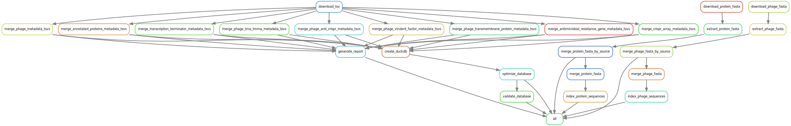

# Welcome to PBI Documentation

**Phage-Bacteria Interaction Database Pipeline**

PBI is a comprehensive bioinformatics pipeline that integrates phage genomic data from the [PhageScope databases](https://phagescope.deepomics.org/database) into a unified, queryable format. Built with Snakemake and powered by DuckDB, it provides fast access to phage genomes, proteins, and metadata for research and analysis. It also includes available host reference genomes obtained from the RefSeq database. Future development will aim to provide the precise strain of the host when available.

## Quick Start

New to PBI? Get started in minutes:

<div class="grid cards" markdown>

-   **Docker Setup** (Recommended)

    ---

    Fastest way to get started. Just build and run!

    ```bash
    docker compose build pipeline
    docker compose run --rm pipeline
    ```

    [Docker Guide →](guides/docker-guide.md)

-   **Local Installation**

    ---

    For development and customization.

    ```bash
    conda env create -f workflow/envs/base_environment.yaml
    pip install -e .
    ./run_local.sh
    ```

    [Installation Guide →](guides/installation.md)

</div>

## What You Get

- ~873,000 phage genomes with complete metadata
- ~43 million protein annotations with functional predictions
- Optimized DuckDB database (~15 GB) for fast queries
- Indexed FASTA files (~100 GB) with pyfaidx for rapid sequence retrieval
- REST API for programmatic access
- Python package for data analysis and machine learning

## Pipeline Overview

The PBI pipeline follows a systematic data flow from download to analysis-ready outputs:



The pipeline:

1. **Downloads** data from PhageScope and other sources
2. **Extracts & merges** FASTA files and metadata from 14+ databases
3. **Optimizes** data into a star schema DuckDB database
4. **Indexes** sequences for fast random access
5. **Validates** data quality with comprehensive reports

### Architecture Diagram

```
┌─────────────────────────────────────────────────────────────┐
│                   PBI Pipeline Architecture                  │
│                                                              │
│  ┌──────────────┐         ┌──────────────┐                 │
│  │  Data Sources│         │   Pipeline    │                 │
│  │  PhageScope  │────────▶│  (Snakemake)  │                 │
│  │  NCBI RefSeq │         │               │                 │
│  │  + 12 more   │         └───────┬───────┘                 │
│  └──────────────┘                 │                         │
│                                   ▼                         │
│                        ┌────────────────────┐               │
│                        │  Data Processing   │               │
│                        │  - Extract FASTA   │               │
│                        │  - Merge metadata  │               │
│                        │  - Optimize schema │               │
│                        └─────────┬──────────┘               │
│                                  │                          │
│                                  ▼                          │
│                   ┌──────────────────────────┐              │
│                   │   Final Outputs          │              │
│                   │  ├─ DuckDB Database      │              │
│                   │  ├─ Indexed FASTA files  │              │
│                   │  └─ HTML Reports         │              │
│                   └──────────┬───────────────┘              │
│                              │                              │
│              ┌───────────────┴───────────────┐              │
│              ▼                               ▼              │
│     ┌─────────────────┐           ┌──────────────────┐     │
│     │   REST API      │           │  Python Package  │     │
│     │   (FastAPI)     │           │  (pbi)           │     │
│     └─────────────────┘           └──────────────────┘     │
│                                                              │
└──────────────────────────────────────────────────────────────┘
```

## Documentation

<div class="grid cards" markdown>

-   **[Guides](guides/overview.md)**

    ---

    Step-by-step instructions for installation, Docker, and usage

-   **[Database](database/overview.md)**

    ---

    Schema documentation, tables, and data sources

-   **[API Reference](api/overview.md)**

    ---

    REST API endpoints and examples

-   **[Developer Guide](developer/code-structure.md)**

    ---

    Architecture, contributing, and code structure

</div>

## Use Cases

PBI is designed for:

- **Phage Research**: Access comprehensive phage genomic data
- **Machine Learning**: Build phage-host interaction prediction models
- **Comparative Genomics**: Analyze phage diversity and evolution
- **Therapeutic Development**: Identify phage candidates for therapy
- **Meta-analysis**: Aggregate data from multiple databases

## Current Status

| Component | Status | Description |
|-----------|--------|-------------|
| **Pipeline** | Complete | Snakemake workflow with 14+ data sources |
| **Database** | Complete | Optimized DuckDB with star schema |
| **Sequences** | Complete | Indexed FASTA files (phages, proteins, hosts) |
| **Docker** | Complete | Production-ready containers |
| **Python Package** | Active Development | Core functionality available |
| **REST API** | Active Development | Basic endpoints functional |
| **Documentation** | Active Development | Continuously improving |

## Need Help?

- Browse the [guides](guides/overview.md) for detailed instructions
- Report issues on [GitHub](https://github.com/ThibaultSchowing/PBI/issues)
- Check the [troubleshooting sections](guides/installation.md#troubleshooting) in our guides

---

**Ready to start?** Choose your installation method: [Docker](guides/docker-guide.md) or [Local](guides/installation.md)

_This project is under active development. Built with Snakemake, DuckDB, and FastAPI._

